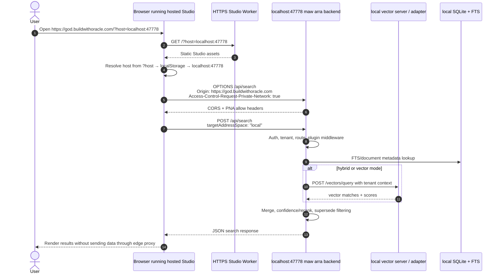

# HTTPS Studio to localhost backend to vector flow (#2312)

Issue #2312 adds a personal-use path where hosted HTTPS Studio assets talk
directly to the operator's local Oracle backend. The Cloudflare Worker serves the
static Studio shell, but the browser sends API calls to `http://localhost:47778`
instead of proxying through the Worker or a cloudflared tunnel.

## When to use this pattern

Use this for a single operator who wants a public HTTPS Studio URL while keeping
all memory, plugins, and vectors local. Do not use it for shared/team access,
mobile clients, or remote machines that cannot reach the operator's loopback
interface.

```text
Hosted Studio URL: https://god.buildwithoracle.com/?host=localhost:47778
Backend URL:       http://localhost:47778
Vector sidecar:    http://localhost:<vector-port> or backend-selected adapter
```

## Sequence diagram



## Browser-side contract

The frontend API client owns host resolution and persistence:

1. Read `?host=` on first load.
2. Persist the host in `localStorage` under the Oracle Studio key.
3. Redirect to a clean URL without the query parameter.
4. Default to `localhost:47778` when no value exists.
5. Build API URLs as `http://<host>/api/*` for local direct mode.
6. Add Private Network Access metadata such as `targetAddressSpace: 'local'` on
   fetches where the browser supports it.
7. Show a "Connect to your Oracle" setup gate when health checks fail.

Keep `/api/*` same-origin proxy mode available for production Cloudflare/Vercel
setups that use `ORACLE_ORIGIN_URL` or `ORACLE_URL` instead.

## Backend contract

The local backend must accept the hosted Studio origin without weakening the rest
of the API boundary:

- `maw arra serve --port 47778` answers `GET /api/health` locally.
- CORS allows the hosted Studio origin and requested auth/tenant headers.
- Private Network Access preflight returns
  `Access-Control-Allow-Private-Network: true` for approved origins.
- API token auth still applies when `ARRA_API_TOKEN` is configured.
- Tenant headers remain explicit; browser-provided tenant IDs are not trusted as
  authorization by themselves.

## Vector flow

Vector search stays behind the backend. The browser never calls LanceDB, Qdrant,
TurboVec, or embedding providers directly.

```text
Browser -> http://localhost:47778/api/search
Backend -> local DB / FTS
Backend -> vector server or selected vector adapter
Backend -> confidence/rerank/supersede response
```

If a separate vector sidecar is running, the backend should use the existing
vector proxy config, for example `ORACLE_PROXY_VECTOR_URL`. If no vector sidecar
is available, the backend keeps FTS fallback behavior and the UI should surface
that degraded mode rather than routing around the backend.

## Security boundaries

- The Worker serves assets only in this pattern; it cannot read local documents.
- The browser talks to the operator's own loopback backend.
- The local backend is still responsible for auth, tenant scoping, CORS, PNA,
  plugin permissions, and vector fallback.
- Use cloudflared + `ORACLE_ORIGIN_URL` instead when other people or devices need
  to reach the same backend.

## Failure states

| Symptom | Expected UI / operator action |
| --- | --- |
| `GET /api/health` fails | Show BackendGate with start command and host picker. |
| PNA preflight rejected | Explain that the backend must allow the hosted origin and PNA header. |
| Browser lacks local-network support | Offer cloudflared production deploy as fallback. |
| Vector sidecar down | Keep FTS search available and show vector degraded status. |
| Token mismatch | Prompt for the backend token without changing the saved host. |

## References

- [#2312 direct HTTPS Studio to localhost pattern](https://github.com/Soul-Brews-Studio/arra-oracle-v3/issues/2312)
- [Cloudflared origin contract](./cloudflared-origin-contract.md)
- [Deploy topologies](./deploy-topologies.md)
- [MDN secure contexts](https://developer.mozilla.org/en-US/docs/Web/Security/Defenses/Secure_Contexts)
- [Chrome local network access](https://developer.chrome.com/blog/local-network-access)
