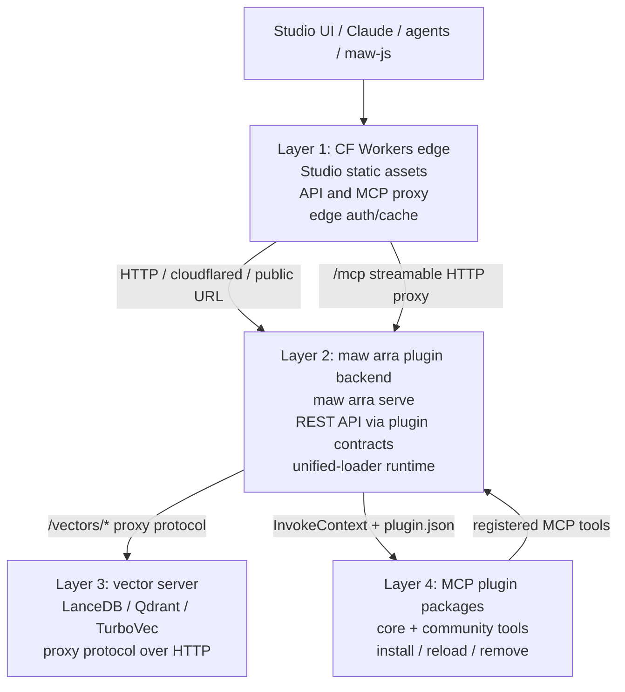

# Modular backend architecture (#2227)

Arra Oracle's backend target is modular, not a monolith. Cloudflare Workers stay
thin at the edge, the installable backend runs as the `maw arra` plugin surface,
vector storage/search runs behind a separate vector-server contract, and MCP
tools plug in or out through unified plugin manifests.

## Target diagram



## Layer responsibilities

| Layer | Owns | Must not own |
| --- | --- | --- |
| CF Workers edge | Studio static assets, `/api/*` proxying, remote `/mcp` entry, lightweight auth/cache, public routing. | Local SQLite, LanceDB files, heavy indexing, plugin package discovery, long-lived backend state. |
| `maw arra` plugin backend | Backend process lifecycle, Elysia REST routes, tenant/auth middleware, plugin registration, MCP tool registry, vector proxy client. | Browser asset hosting as primary concern, native vector storage internals, direct Cloudflare-only assumptions. |
| Vector server | Embeddings/vector collections, LanceDB/Qdrant/TurboVec adapters, `/vectors/*` protocol, GPU/disk-heavy operations. | HTTP product routes, MCP protocol, edge routing, plugin install UX. |
| MCP plugin system | Core/community tool manifests, tool enable/disable/reload, `InvokeContext` handlers, API/menu/MCP surface projection. | Starting the whole backend by accident, bypassing tenant/auth context, hardcoding tool lists in Workers. |

## Layer 1: CF Workers edge

Workers are the public, low-latency shell:

- `workers/studio` serves the Vite Studio build and forwards `/api/*` to the
  backend.
- `workers/mcp` exposes a remote MCP endpoint and proxies safe tool calls to the
  backend.
- Future plugin endpoints can be edge routes only when they stay stateless or
  proxy to the backend.

Workers should be replaceable by Vercel or another frontend host. That is why
Workers do not own the database, local filesystem, LanceDB, or unified plugin
installation.

## Layer 2: `maw arra` plugin backend

The backend should be started and managed through the installable maw plugin:

```bash
maw arra serve --port 47778
```

The backend owns product behavior:

- route registration and middleware order;
- tenant scoping and backend auth;
- plugin discovery through unified-loader;
- API, menu, MCP, proxy, export, and sidecar server surfaces;
- vector-store selection and proxying.

Current alpha can start the backend from the in-repo ARRA plugin `serveCli()`
path, which still launches `bun run server`. The target is to preserve that
runtime behavior while making the external `maw arra serve` install/discovery
path the operator-facing entrypoint.

## Layer 3: vector server

Vector work belongs in a separate process because it can require disk-heavy
indexes, native libraries, GPU/accelerated embedding services, or provider
credentials that do not fit Workers.

Backend-to-vector communication should use the proxy contract:

```text
GET    /health
POST   /vectors/add
POST   /vectors/query
GET    /vectors/stats
DELETE /vectors/collection
```

Configuration should prefer an explicit proxy endpoint such as
`ORACLE_PROXY_VECTOR_URL`, with compatibility for existing vector backend env
aliases. The backend remains responsible for tenant headers, timeout policy, and
fallback behavior; the vector server remains responsible for collection-specific
storage/search.

## Layer 4: MCP plugin system

MCP tools are a runtime projection of plugin packages, not a hardcoded edge list.
The unified plugin manifest is the source of truth:

```json
{
  "mcpTools": [
    { "name": "oracle_example", "handler": "run", "enabledByDefault": true }
  ]
}
```

The backend loads core tools plus plugin tools, rejects unsafe name collisions,
and exposes the resulting registry to stdio MCP, HTTP MCP catalogs, and remote
MCP proxy paths. Plugin reload should allow adding/removing tools without editing
core server code.

## Request flows

### Studio API call

1. Browser loads Studio from Workers or Vercel.
2. Browser calls `/api/search` on the same origin.
3. Edge host rewrites to the maw plugin backend.
4. Backend applies auth/tenant middleware and runs the route.
5. If semantic search is needed, backend calls the vector server.

### Remote MCP tool call

1. Claude/agent connects to the Worker `/mcp` endpoint.
2. Worker handles MCP transport and proxies tool execution to backend HTTP.
3. Backend dispatches to a core or plugin MCP tool through unified-loader.
4. Tool handlers use `InvokeContext`, tenant context, and vector proxy services.

### Plugin install/remove

1. Operator installs or removes a plugin package in the maw/plugin directory.
2. Backend reloads unified-loader state.
3. API routes, menus, MCP tools, proxies, and sidecar servers update from the
   manifest.
4. Workers keep proxying; they do not need a deploy for every tool change.

## Boundary contracts

- **Edge -> backend:** HTTP(S) URL, bearer/tenant headers, `/api/*`, `/mcp` proxy
  paths, no direct DB access.
- **Backend -> vector server:** `/vectors/*` proxy protocol, tenant headers,
  timeout/error normalization.
- **Backend -> plugins:** `plugin.json` surfaces plus `InvokeContext`; plugin
  errors degrade one surface, not the whole backend.
- **MCP clients -> tools:** tool schema and tool response contracts remain stable
  even when the implementation comes from a plugin.

## Design rules

1. CF Workers are the edge shell, not the brain.
2. `maw arra serve` is the operator entrypoint for the backend.
3. Vector search is a separate process behind a protocol, not a local assumption.
4. MCP tools are installable plugin surfaces, not a fixed core list.
5. Tenant/auth context crosses every boundary explicitly.
6. Each layer can be tested or replaced without redeploying all other layers.

## Readiness markers

- Workers can serve Studio and expose remote MCP while proxying to the backend.
- The backend can start through the ARRA maw plugin and report `/api/health`.
- Backend vector config can point at a standalone vector server URL.
- MCP plugin tools can be added, reloaded, disabled, and removed without core
  edits.
- An end-to-end smoke covers Workers -> backend -> vector server -> plugin MCP
  tool dispatch.
